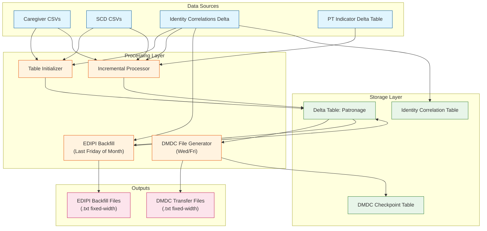
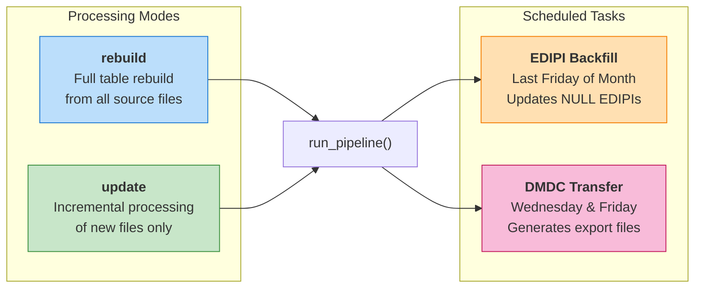
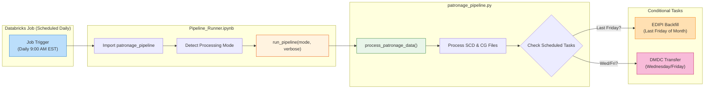
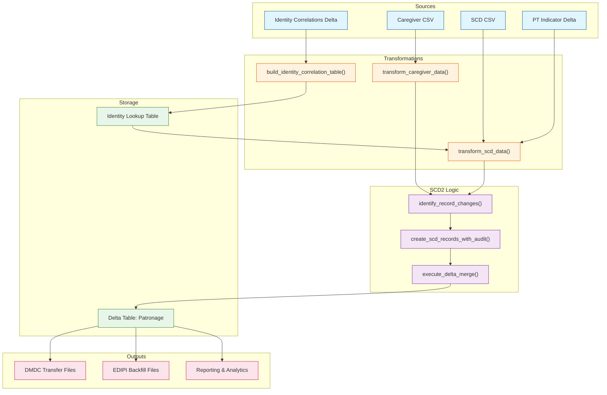
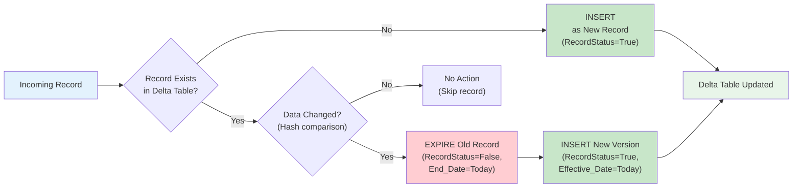
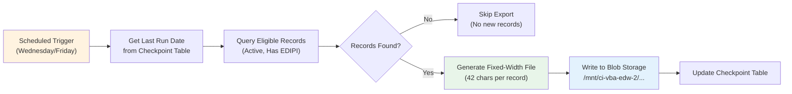

# VA Patronage Data Pipeline

A robust, production-grade ETL pipeline for processing Veteran patronage data from Service Connected Disability (SCD) and Caregiver (CG) sources using PySpark and Delta Lake on Databricks.

---

## High-Level Architecture



---

## Processing Modes

The pipeline supports multiple processing modes to handle different operational scenarios:



| Mode | Trigger | Description |
|------|---------|-------------|
| `rebuild` | Manual | Drops existing table and reinitializes from all source files |
| `update` | Manual/Scheduled | Processes only new files since last run (incremental) |
| **EDIPI Backfill** | Auto (Last Friday) | Retroactively updates records with EDIPI from Identity Correlations |
| **DMDC Transfer** | Auto (Wed/Fri) | Generates 42-character fixed-width files for DMDC downstream system |

---

## Databricks Job Execution Flow

The pipeline runs as a scheduled Databricks Job:



### Key Operational Notes
- **Daily Processing**: The job runs every day in `update` mode, processing only new files since the last run
- **Automatic Task Triggers**: EDIPI Backfill and DMDC Transfer tasks are triggered automatically based on the day of the week/month
- **Monitoring**: Job status and logs are available in the Databricks Jobs UI
- **Alerts**: Email notifications are sent on job failure to the data engineering team
- **Manual Runs**: The pipeline can be triggered manually from the Databricks Jobs UI or by running the notebook directly

---

## ETL Workflow Diagram

```mermaid
flowchart LR
    A["Raw Data Sources<br/>(SCD CSVs, CG CSVs)"] --> B["File Discovery<br/>discover_unprocessed_files()"]
    B --> C["Data Preparation<br/>transform_scd_data() / transform_caregiver_data()"]
    C --> D["Identity Correlation<br/>Join with ICN/EDIPI lookup"]
    D --> E["Deduplication<br/>Window functions + ranking"]
    E --> F["SCD2 Upsert Logic<br/>execute_delta_merge()"]
    F --> G["Delta Table: Patronage"]
    G --> H["DMDC Export<br/>generate_dmdc_transfer_file()"]
    
    style A fill:#e3f2fd
    style G fill:#e8f5e9
    style H fill:#fce4ec
```



---

## Data Lineage Diagram



---

## SCD2 Upsert Logic Flow

The pipeline implements Slowly Changing Dimension Type 2 (SCD2) to maintain complete historical records:



### Change Detection
- **SCD Records**: Hash comparison of `SC_Combined_Disability_Percentage` and `PT_Indicator`
- **Caregiver Records**: Hash comparison of `Status_Begin_Date`, `Status_Termination_Date`, `Applicant_Type`, `Caregiver_Status`

---

## DMDC Transfer File Generation

The pipeline generates fixed-width transfer files for the DMDC (Defense Manpower Data Center) downstream system:



### DMDC Record Format (42 characters)
| Field | Width | Description |
|-------|-------|-------------|
| EDIPI | 10 | Electronic Data Interchange Personal Identifier |
| Batch_CD | 3 | Source type (SCD/CG) |
| SC_Combined_Disability_Percentage | 3 | Combined disability rating |
| Status_Begin_Date | 8 | YYYYMMDD format |
| PT_Indicator | 1 | Permanent/Total indicator |
| Individual_Unemployability | 1 | Unemployability flag |
| Status_Last_Update | 8 | YYYYMMDD format |
| Status_Termination_Date | 8 | YYYYMMDD format |

---

## EDIPI Backfill Process

Monthly process to retroactively populate EDIPI for records that were created without one:


---

## Business Logic Overview

### Core Processing Pipeline

| Component | Function | Description |
|-----------|----------|-------------|
| **Table Initializer** | `initialize_patronage_table()` | Creates Delta table from SCD and CG seed files |
| **Identity Builder** | `build_identity_correlation_table()` | Daily refresh of ICN-to-EDIPI lookup table |
| **File Discovery** | `discover_unprocessed_files()` | Scans blob storage for new/unprocessed files |
| **SCD Transformer** | `transform_scd_data()` | Prepares SCD records with PT indicator enrichment |
| **CG Transformer** | `transform_caregiver_data()` | Prepares Caregiver records with status mapping |
| **Change Detector** | `identify_record_changes()` | Hash-based comparison for SCD2 logic |
| **Delta Merger** | `execute_delta_merge()` | Applies upserts/expirations to Delta table |
| **DMDC Generator** | `generate_dmdc_transfer_file()` | Creates fixed-width export files |
| **EDIPI Backfill** | `run_edipi_backfill()` | Monthly EDIPI population from identity correlations |

### Data Sources

| Source | Type | Description |
|--------|------|-------------|
| **SCD CSVs** | Service Connected Disability | Veteran disability ratings (`CPIDODIEX_*.csv`) |
| **Caregiver CSVs** | CARMA Exports | Caregiver program data (`*caregiver*.csv`) |
| **Identity Correlations** | Delta Table | MVI person-identifier mappings |
| **PT Indicator** | Delta Table | Permanent/Total disability indicators |

### Key Features

- **SCD Type 2**: Full history tracking with `RecordStatus`, `Effective_Date`, `End_Date`
- **Delta Lake**: ACID-compliant storage with efficient upserts and time travel
- **Liquid Clustering**: Optimized by `Batch_CD` and `RecordStatus` for query performance
- **Audit Trail**: Every change logged with `change_log` column documenting what changed
- **Checkpointing**: DMDC exports track last run timestamp to avoid duplicates
- **Broadcast Joins**: Performance optimization for small lookup tables

---

## Key Constants and Configuration

```python
# Source Types
SOURCE_TYPE_SCD = "SCD"   # Service Connected Disability
SOURCE_TYPE_CG = "CG"     # Caregiver

# Table Names
PATRONAGE_TABLE_NAME = "patronage"
IDENTITY_TABLE_NAME = "identity_correlation_lookup"
DMDC_CHECKPOINT_TABLE_NAME = "dmdc_export_checkpoint"

# Scheduled Tasks
# - EDIPI Backfill: Last Friday of each month
# - DMDC Export: Every Wednesday and Friday
```

---

## Usage

### Running the Pipeline

```python
import patronage_pipeline as pipeline

# Incremental update (processes new files only)
pipeline.run_pipeline("update", verbose_logging=False)

# Full rebuild (reinitializes from all source files)
pipeline.run_pipeline("rebuild", verbose_logging=True)
```

### From the Notebook Orchestrator

The `Pipeline_Runner.ipynb` notebook provides:
- Automatic mode detection (initialize vs update)
- Visual Mermaid diagrams
- File reconciliation tools
- Unit testing cells

---

## References

- Delta Lake Documentation: https://docs.delta.io/latest/delta-intro.html
- PySpark Documentation: https://spark.apache.org/docs/latest/api/python/
- Databricks Delta Lake Guide: https://docs.databricks.com/delta/index.html

---

## Contributors

- **Umair Ahmed**: QA Engineer
- **Bhavesh Patel**: Data Engineer

---

## Version History

| Date | Version | Changes |
|------|---------|---------|
| 2024-12-18 | 1.0 | Initial release with SCD and Caregiver processing |
| 2025-11-19 | 2.0 | Added EDIPI Backfill, DMDC Transfer, refactored for modularity |
| 2025-11-26 | 2.1 | Code quality improvements, DRY patterns, enhanced logging |

